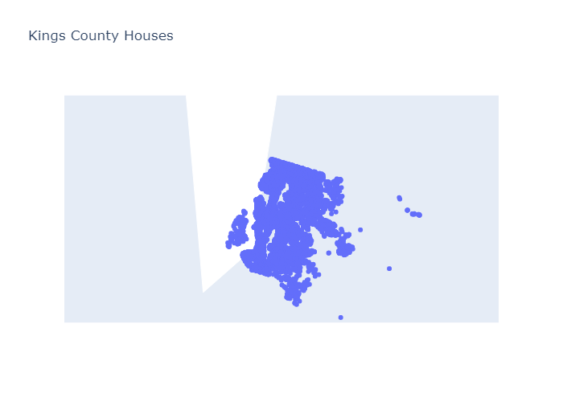
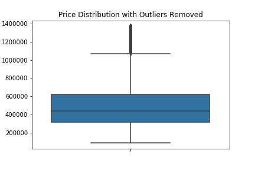

# Housing Data Analysis

**Author**: [Christie Sarver](mailto:christie.sarver@gmail.com)

## Overview

For this project the Kings County housing dataset is used to solve a housing-related business problem using linear regression techniques. I used the CRISP-DM Data Science method which the structure the Jupyter Notebook  follows, demonstraing an iterative modeling process with feature engineering, model fit, evaluation, and repeating until the model proves to be useful to the business case.


### The Data

This data includes house sale prices and descriptive features from houses sold through 2014-2015 in the Seattle area. These houses were built as early as 1900 and as late as 2015. The data includes several variables that describe the house, its location, and its condition. 

The image below shows a scatter plot of the houses in the data. 



### Business Problem

The stakeholder for this project, a housing development company, working on new model homes, wants to design houses that will sell to middle class buyers who are currently facing a shortage of available and affordable inventory due to the increase in demand during 2020.

The median national home listing price grew by 13.4% over last year nationally, and The Seattle-Tacoma-Bellevue metro area saw YoY listing prices rise 7.8% with a median price of $627,500. Meanwhile, there was a 35.6% decrease in listings. So less houses available and higher prices.

The developers would like understand which features a home should include at the median price range so that they can appropriately design new homes to replenish inventory and make some sales where they know demand exists.

## Methodology

Following the CRISP-DM method for linear regression modeling, data was cleaned and processed to include only the most relevant features. Strategical thinking was also applied to make sure feature engineering decisions were applicable to the business problem.

Features included in the data that were not in the model include:
* Condition
* Year sold
* Waterfront
* Zipcode (different location variables were included)

From the predictor variable, price, outliers were removed so that only the most relevant data was included based on the pricing parameters for the business case. The image below shows the distribution of data before the second round of outliers was removed



Additionally, features were transformed using log trasformation and scaling to normalize distributions and help interpret the data. Some variables were adapted to be more descriptive and relevant. 

## Results

### Business Results and Recommendation

The final model analysis describes the following. 

Features that drive value in homes for our target buyer are:
* Size of the home interior
* Number of bathrooms (more so than bedrooms)
* High construction quality and materials

The value is significantly decreased where:
 * Construction quality is average or low
* House is further away from the city center

Based on this, recommendations for the housing developers are

* Focus on maximizing the living area of the house over the yard size, or adding a basement
* Use high quality construction methods 
* Build multi-floor homes and include ample bathrooms to reflect what buyers are looking for

### Technical Recommendation/Future Work

If there is further work on this project, I would recommend continuing to engineer features of the model in order to improve the R2 score and decrease error. Although I didn't detect any interactions, I would recommend looking more into how the features interact and relate to each other.
To make the model more generalizable, it would also be interesting to include data from multiple markets to see what trends are local vs specific to this market and potentially build multiple models to show the differences.

## Conclusions

While the data cleaning and transformations I made to this data followed best practices to fit it to a linear regression model, it didn't end up as accurate as I would have hoped. However, I was able to inform my business question by defining features of a home that would be important to a certain segment of buyers and eliminating many that do not prove to affect price.

## For More Information

See the full analysis in the [Jupyter Notebook](./Housing%20Data%20Model%20&%20Analysis.ipynb) or review this [presentation](./Housing%20Data%20Analysis%20Presentation.pdf).

## Repository Structure

```
├── Archive
├── Images
├── data
├── Housing Data Model & Analysis.ipynb
├── Housing Data Analysis Presentation.pdf
├── README.md

```
Thank you!
